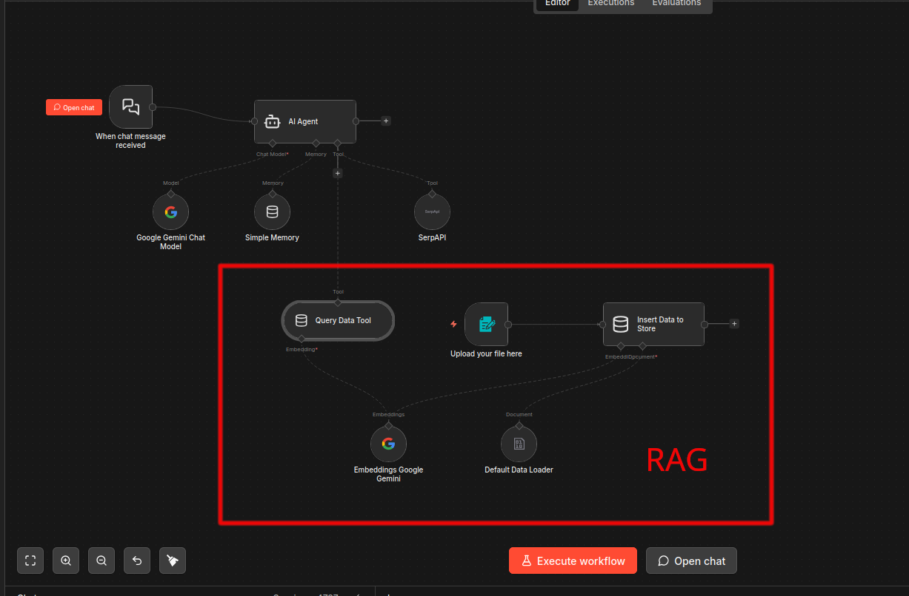
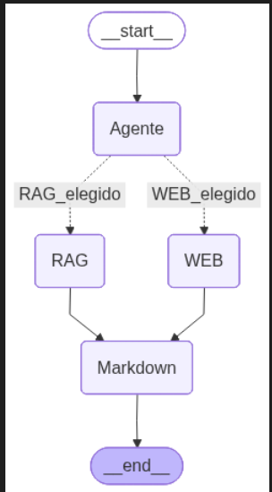
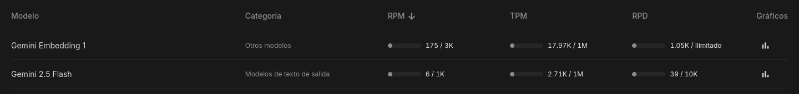
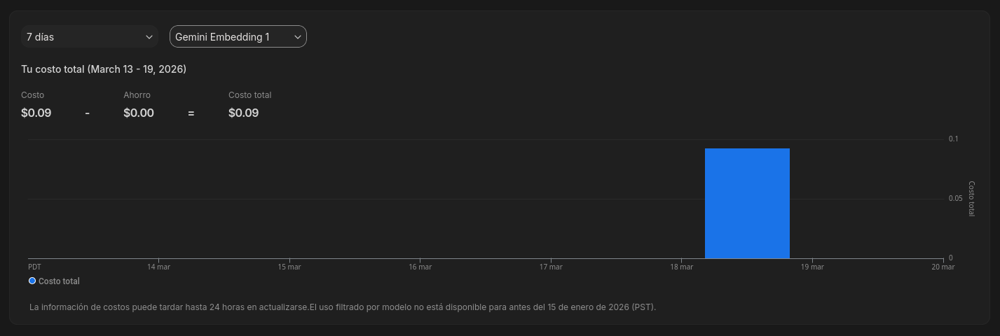
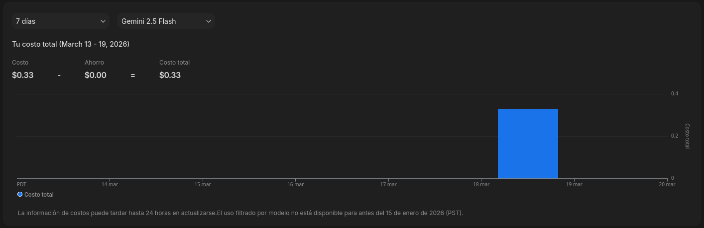

# Inmersion_Agentes_IA_Alura_Latam

## Requerimientos

Este proyecto requiere **Python 3.12+**.

## Instalación

1. Clona el repositorio:
 	>```bash
 	> git clone https://github.com/tu-usuario/proyecto.git
 	>```
2. Crea un entorno virtual (opcional):
   	>```bash
 	> python -m venv venv
 	>```
3. Activa el entorno e instala las dependencias:
	>```bash
 	> pip install -r requirements.txt
 	>```

## Descripción

Notas de la Inmersión Dev, Agentes de AI, impartida por Alura Latam. En esta se realiza una breve introducción al mundo de los Agentes de AI, con una duración de 3 días. Las clases se liberaron los días 16, 17 y 18 de marzo del 2026, una por día.

En la primera clase se introdujo a la construcción del workflow de un agente de AI sencillo basado en RAG. Para este ejercicio se uso la interfaz proporcionada por [N8N](https://n8n.io/), y se usó [Google Gemini](https://aistudio.google.com/) como motor de AI.

En este workflow se introdujo un RAG proporcionado por algunos documentos que fungieron de data interna de una empresa ficticia, así como un nodo de búsqueda en web proporcionada por [SerpAPI](https://serpapi.com/).



En la segunda clase se trasladó los conceptos aprendidos en la primera clase al código. Se introdujo el framework llamado *LangChain*, que facilita la creación de aplicaciones impulsadas por LLMs. Se realizó la creación de un RAG para la búsqueda en la base de datos internas.

Para la tercera y última clase, se completaron todos los pasos necesarios para crear un workflow operativo. Aprovechando el RAG creado en la clase anterior, se utilizó el framework *LangGraph*, una extensión de *LangChain*, para crear el flujo como si fuera un grafo.

El grafo resultante es el siguiente



De la misma forma que en N8N, el motor de AI usado fue Gemini, y el de búsqueda web fue SerpAPI.

## Costo de ejecución

Tanto el motor de Gemini, como la APi de SerpAPI, son servicios de pago. Por supuesto, ambos tienen un limite máximo gratuito utilizable, no obstante, me encontré con un limite insuficiente al usar Gemini.

Por esa razón, decidí vincular mi TDC al proyecto creado en Google Ai Studio. En parte, para agilizar el proyecto y en parte también por curiosidad de cuanto dinero costaría echar andar los notebooks con código de este repositorio.

Los limites gratuitos que me fueron insuficientes fueron las **Solicitudes por minuto (RPM) de Gemini Embedding 1**, que se fijan en 100. Este no es un problema muy grande de esquivar; se usa un `sleep(60)` y te aseguras de mantener la tasa. Pero, claro, esto aumenta el tiempo de ejecución.

El problema mayor fue el limite de **Solicitudes por día (RPD) del motor Gemini 2.5 Flash** utilizado para el procesamiento de la búsqueda. Este estaba fijo en solo 5. Dado los ejemplos realizados en los notebooks, este límite era alcanzado fácilmente.

Estas son las estadísticas de uso de recursos de mi programa al extender los límites vinculando un método de pago:



El costo de las solicitudes hechas al modelo **Gemini Embedding 1**, fue de apenas **$0.09 MXN** (pesos mexicanos),



Y el costo de las solicitudes para el motor **Gemini 2.5 Flash**, fue de **$0.33 MXN**,



Esto dio un total de **$0.42 MXN** por la ejecución de todo el código en este repositorio.

Lamentablemente, y como es común en muchas transacciones, la tasa de cambio con el dólar estadounidense (USD), los costos de operación y las comisiones por cambios de divisas, son omitidas; o bien es complicado llegar a ellas. Por eso, lo mejor es realizar una estimación usando el rango de cambio **$17.50-$17.73 MXN por USD**.


| Modelo             | MXN       | USD                         |
|--------------------|:---------:|:---------------------------:|
| Gemini 2.5 Flash   | $0.33     | ~ \$0.01896 - \$0.01861     |
| Gemini Embedding 1 | $0.09     | ~ \$0.00514 - \$0.00507     |
| **Total**          | **$0.42** | **~ \$0.02400 - \$0.02369** |

Al final, el cargo que se hará a mi tarjeta será de **$0.49 MXN incluyendo impuestos** (16% de IVA). Toda la ejecución me costó nada más y nada menos que un tostón.